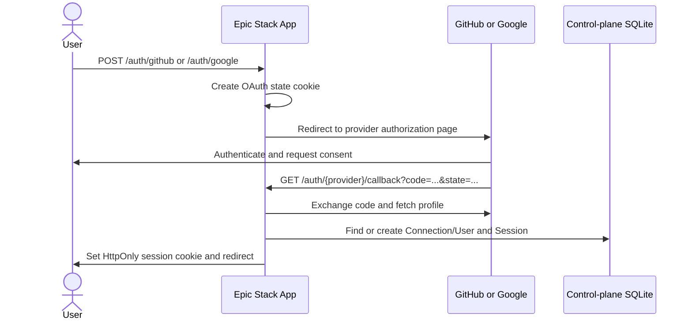

# GitHub and Google Login

Epic Stack includes server-side OAuth login for the operator application in
`apps/app`. This guide explains how to create provider credentials, configure
the app, and verify the complete login flow.

<Note>
	This is for operator login to the App/Admin control plane. It is separate from
	tenant-site customer authentication, which uses phone OTP through the regional
	tenant API. It is also separate from the GitHub **integration**, which uses
	`GITHUB_INTEGRATION_CLIENT_ID` and the `/api/integrations/oauth/callback`
	route.
</Note>

## How the login flow works

The login buttons on `/login` and `/signup` submit to the App's provider routes:



The callback handler then applies these rules:

1. If the provider account is already connected, the existing user is signed
   in.
2. If the provider account is being used by a signed-in user, it is linked from
   the account settings page.
3. If the provider email matches an existing user, the provider account is
   linked to that user and a session is created.
4. A new provider account is sent to `/onboarding/{provider}`. The user chooses
   a username, confirms their name, accepts the terms, and then receives a
   session.
5. If the user has two-factor authentication enabled, the new session goes
   through the existing 2FA verification step.

The final operator session is stored in an HttpOnly, SameSite=Lax cookie signed
with `SESSION_SECRET`. Normal sessions last 24 hours; “Remember me” sessions
last 30 days.

## Environment variables

The provider strategies are registered only when all three variables for that
provider are present. Configure these in the App environment, not in the
Mintlify documentation site:

| Variable               | Required       | Value                                                    |
| ---------------------- | -------------- | -------------------------------------------------------- |
| `GITHUB_CLIENT_ID`     | Yes for GitHub | Client ID from a GitHub OAuth App                        |
| `GITHUB_CLIENT_SECRET` | Yes for GitHub | Client secret generated by GitHub                        |
| `GITHUB_REDIRECT_URI`  | Yes for GitHub | Exact App callback URL ending in `/auth/github/callback` |
| `GOOGLE_CLIENT_ID`     | Yes for Google | OAuth client ID for a Google Web application             |
| `GOOGLE_CLIENT_SECRET` | Yes for Google | OAuth client secret generated by Google                  |
| `GOOGLE_REDIRECT_URI`  | Yes for Google | Exact App callback URL ending in `/auth/google/callback` |

`BASE_URL` must also be the public origin of the App. It is used for the
operator session/cookie configuration and must not point to the docs site.

Do not confuse these with the GitHub integration variables:

- Login: `GITHUB_CLIENT_ID`, `GITHUB_CLIENT_SECRET`,
  `GITHUB_REDIRECT_URI`
- GitHub integration: `GITHUB_INTEGRATION_CLIENT_ID`,
  `GITHUB_INTEGRATION_CLIENT_SECRET`, callback
  `/api/integrations/oauth/callback`

## Local development

Create or edit `apps/app/.env`. The file is gitignored; never commit OAuth
secrets.

Choose one local origin and use it consistently in the provider console, the
redirect variables, and the browser:

### Direct App server

Use this when running only `npm run dev:app`:

```bash
BASE_URL="http://localhost:3001"

GITHUB_CLIENT_ID="your-github-client-id"
GITHUB_CLIENT_SECRET="your-github-client-secret"
GITHUB_REDIRECT_URI="http://localhost:3001/auth/github/callback"

GOOGLE_CLIENT_ID="your-google-client-id"
GOOGLE_CLIENT_SECRET="your-google-client-secret"
GOOGLE_REDIRECT_URI="http://localhost:3001/auth/google/callback"
```

Open `http://localhost:3001/login`.

### Full local stack through the HTTPS proxy

The full `npm run dev` command uses the local HTTPS proxy on port `2999`. The
hostname is generated from the brand configuration; after setup it normally
looks like `https://app.epic-startup.test:2999`:

```bash
BASE_URL="https://app.epic-startup.test:2999"

GITHUB_CLIENT_ID="your-github-client-id"
GITHUB_CLIENT_SECRET="your-github-client-secret"
GITHUB_REDIRECT_URI="https://app.epic-startup.test:2999/auth/github/callback"

GOOGLE_CLIENT_ID="your-google-client-id"
GOOGLE_CLIENT_SECRET="your-google-client-secret"
GOOGLE_REDIRECT_URI="https://app.epic-startup.test:2999/auth/google/callback"
```

Open the exact `BASE_URL` host at `/login`. Do not mix a callback on
`localhost:3001` with a browser session on `app.<brand>.test:2999`; the OAuth
state cookie belongs to the origin that started the flow.

### Mock login for local development

Real provider credentials are not needed to run the default mocked development
flow. Values beginning with `MOCK_` activate the provider mock:

```bash
GITHUB_CLIENT_ID="MOCK_GITHUB_CLIENT_ID"
GITHUB_CLIENT_SECRET="MOCK_GITHUB_CLIENT_SECRET"
GITHUB_REDIRECT_URI="http://localhost:3001/auth/github/callback"

GOOGLE_CLIENT_ID="MOCK_GOOGLE_CLIENT_ID"
GOOGLE_CLIENT_SECRET="MOCK_GOOGLE_CLIENT_SECRET"
GOOGLE_REDIRECT_URI="http://localhost:3001/auth/google/callback"
```

`npm run dev` starts with `MOCKS=true`. Use real, non-`MOCK_` credentials when
you want to exercise GitHub or Google itself. The mock values are for local
development and tests only.

## Set up GitHub login

Create a GitHub **OAuth App**, not a GitHub App. GitHub's official instructions
are in [Creating an OAuth app](https://docs.github.com/en/apps/oauth-apps/building-oauth-apps/creating-an-oauth-app).

### 1. Create the OAuth App

1. Sign in to GitHub and open **Settings**.
2. Select **Developer settings** → **OAuth Apps**.
3. Select **New OAuth App**. Older GitHub accounts may show **Register a new
   application**.
4. Enter a public application name, such as `Epic Stack Local`.
5. Set **Homepage URL** to the same origin you use in `BASE_URL`.
6. Set **Authorization callback URL** to the exact value of
   `GITHUB_REDIRECT_URI`, for example:

   ```text
   http://localhost:3001/auth/github/callback
   ```

7. Select **Register application**.
8. Copy the **Client ID** into `GITHUB_CLIENT_ID`.
9. Select **Generate a new client secret**, copy it immediately, and put it in
   `GITHUB_CLIENT_SECRET`.

GitHub compares redirect URLs exactly. The scheme, hostname, port, path, and
trailing slash must match. Create separate OAuth Apps for local, staging, and
production, or explicitly add every required callback URL and keep each
environment's `GITHUB_REDIRECT_URI` aligned with the URL it serves.

The App calls GitHub's authenticated-user and email APIs. The GitHub account
used for login must have a verified email address. If GitHub reports a 403 from
the email endpoint or the App reports that no verified email was found, verify
the account's email and check that the OAuth authorization request includes the
`user:email` scope; GitHub documents that scope requirement in [List email
addresses for the authenticated user](https://docs.github.com/en/rest/users/emails).

## Set up Google login

Create a Google OAuth client for a **Web application**. Google provides the
current server-side flow in [Using OAuth 2.0 for Web Server
Applications](https://developers.google.com/identity/protocols/oauth2/web-server).

### 1. Create or select a Google Cloud project

1. Open the [Google Cloud Console](https://console.cloud.google.com/).
2. Create a project or select the project that owns this environment's OAuth
   credentials.
3. Open **Google Auth Platform**. In older console layouts these settings are
   under **APIs & Services**.
4. Configure the app's branding, support email, audience, and publishing
   status. Choose **Internal** for a Google Workspace-only app; choose
   **External** for users outside that Workspace organization.
5. If the External app is still in **Testing**, add the Google accounts that
   are allowed to sign in as test users. Google limits testing apps to the
   configured test-user list and may expire test authorizations.

### 2. Create the Web application client

1. In Google Auth Platform, open **Clients** and select **Create Client**. In
   older layouts use **APIs & Services** → **Credentials** → **Create
   Credentials** → **OAuth client ID**.
2. Select **Web application** as the application type.
3. Give the client a name such as `Epic Stack Local`.
4. Under **Authorized redirect URIs**, add the exact value of
   `GOOGLE_REDIRECT_URI`, for example:

   ```text
   http://localhost:3001/auth/google/callback
   ```

   For a server-side OAuth flow, the important setting is the authorized
   redirect URI. Add JavaScript origins only if you separately use a
   browser-side Google API.

5. Select **Create**.
6. Copy the generated **Client ID** into `GOOGLE_CLIENT_ID`.
7. Copy the generated **Client secret** into `GOOGLE_CLIENT_SECRET`.

Google requires the redirect URI to match exactly, including `http` versus
`https`, hostname, port, path, and trailing slash. A mismatch produces
`redirect_uri_mismatch`.

The App requests the standard identity scopes `openid`, profile, and email. It
uses the returned subject ID, email, display name, and profile photo; it does
not need a Google API key or a service account for login.

## Configure staging and production

Use the public App origin for each deployed environment. The docs site origin
is never a login callback.

| Environment | GitHub callback                                        | Google callback                                        |
| ----------- | ------------------------------------------------------ | ------------------------------------------------------ |
| Staging     | `https://app-staging.example.com/auth/github/callback` | `https://app-staging.example.com/auth/google/callback` |
| Production  | `https://app.example.com/auth/github/callback`         | `https://app.example.com/auth/google/callback`         |

Replace `example.com` with the value configured for `ROOT_APP` and use the
actual `APP_BASE_URL` for your deployment. Register these URLs in the matching
GitHub OAuth App and Google Web application client.

Set the values on the App Worker with Wrangler. Run these commands from
`apps/app`; Wrangler prompts for each value without printing it:

```bash
# Production/default Worker
npx wrangler secret put GITHUB_CLIENT_ID
npx wrangler secret put GITHUB_CLIENT_SECRET
npx wrangler secret put GITHUB_REDIRECT_URI
npx wrangler secret put GOOGLE_CLIENT_ID
npx wrangler secret put GOOGLE_CLIENT_SECRET
npx wrangler secret put GOOGLE_REDIRECT_URI

# Staging Worker
npx wrangler secret put GITHUB_CLIENT_ID --env staging
npx wrangler secret put GITHUB_CLIENT_SECRET --env staging
npx wrangler secret put GITHUB_REDIRECT_URI --env staging
npx wrangler secret put GOOGLE_CLIENT_ID --env staging
npx wrangler secret put GOOGLE_CLIENT_SECRET --env staging
npx wrangler secret put GOOGLE_REDIRECT_URI --env staging
```

Client IDs and redirect URIs are not passwords, but storing the whole provider
configuration as Worker secrets keeps setup consistent. Never commit either
client secret, a provider export, or a `.env` file. Generate the required
`SESSION_SECRET` separately and keep it stable for the lifetime of the
environment; changing it signs out existing operators.

## Verify the setup

1. Restart the App after changing local environment variables.
2. Open the App's `/login` page, not the Mintlify docs URL.
3. Select **Login with GitHub** or **Login with Google**.
4. Complete provider consent.
5. Confirm that an existing account is signed in, or complete the provider
   onboarding form for a new account.
6. If the user has 2FA enabled, complete the follow-up verification step.
7. In account settings, confirm the provider connection is listed.

## Troubleshooting

### `redirect_uri_mismatch` or GitHub redirect error

Compare the provider-console callback with the corresponding environment
variable character-for-character. Check:

- `http` versus `https`
- `localhost` versus `app.<brand>.test`
- port `3001` versus `2999`
- `/auth/github/callback` versus `/auth/google/callback`
- an accidental trailing slash

### `Auth Failed` after returning from the provider

Confirm that all three variables for the provider are set in the App runtime.
The provider strategy is not registered when any ID, secret, or redirect URI is
missing. For Cloudflare, verify the values on the correct Worker environment
with `wrangler secret list`.

### GitHub says no verified email was found

Verify at least one email address in GitHub account settings and retry. The App
uses the primary verified email when available and otherwise falls back to a
verified email. A GitHub OAuth token must be allowed to read the user's email
addresses.

### Google says the app is not available to this user

If the Google project is External and still in Testing, add the account under
the OAuth consent screen's test users. If the app is meant for the public,
publish it and complete Google's verification steps if Google requires them.

### Login works but the user is immediately sent back to `/login`

Make sure the browser origin, `BASE_URL`, and callback origin are consistent.
For local proxy development, use the HTTPS `app.<brand>.test:2999` host for the
whole flow. Also confirm that `SESSION_SECRET` is set and has not changed
between requests or deployments.
